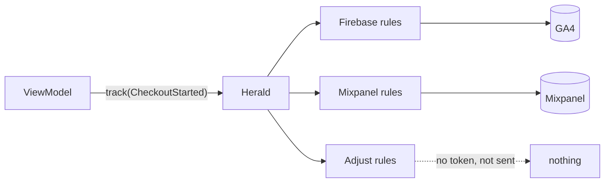

# How Herald passes calls on

`Herald` is the object behind all five interfaces. When a class calls `track`, `Herald` passes the
call to every vendor you registered, and takes care of everything around it: threads, running
vendors side by side, and failures.



## What each call does

1. **Keeps vendor work off your UI.** On Android, Herald leaves the main thread; on Flutter, vendor
   plugins already work off the UI thread. See [Threads](#threads).
2. **Calls every vendor that supports it, at the same time.** A vendor registered without
   `properties`, for example, is skipped for `set`.
3. **Waits for all of them.** The call returns when every vendor has finished, so a second `track`
   that waits for the first never overtakes it at any vendor.
4. **Catches failures.** If a vendor throws, the others carry on.
5. **Reports the failures** to your error reporter, one at a time.

`Herald` doesn't decide which events a vendor sends. It passes everything on, and each vendor's
[factories](factory-chain.md) decide.

## Threads

=== "Kotlin"

    Herald runs vendor calls on a coroutine dispatcher, `Dispatchers.Default` unless you pass
    another:

    ```kotlin
    Herald {
        dispatcher(Dispatchers.IO)                              // or a thread of your own
        // dispatcher(UnconfinedTestDispatcher(testScheduler)) // in tests
    }
    ```

    A call suspends until every vendor has finished, so call Herald from a scope that lives long
    enough: `viewModelScope` for work that belongs to a screen, or an app-wide scope for work that
    must finish even if the screen closes.

=== "Dart"

    There is no dispatcher. A call returns a `Future` that completes when every vendor has
    finished, and vendor plugins already do their work off the UI thread.

    A call starts at once and doesn't wait for earlier ones. Two calls you don't await can reach a
    vendor in either order, so await a call when the next one depends on it:

    ```dart
    await herald.setEnabled(false);
    await herald.track(event); // reaches every vendor after collection is off
    ```

## Failures

Analytics must never break your app, so Herald catches failures at every step:

| What fails | What happens |
| --- | --- |
| a vendor call throws | caught; the other vendors still run; reported to you |
| your error reporter throws | caught; the other failures are still reported |
| the calling coroutine is cancelled (Android) | the cancellation goes on as usual: that's your code stopping, not a vendor failing |

Your error reporter gets the vendor's name, an `AnalyticsOperation` saying what was happening, and
the exception. On Flutter they come together as one `AnalyticsFailure`, with the stack trace too:

| `AnalyticsOperation` | Holds |
| --- | --- |
| `Track(eventName)`, `TrackOperation` on Flutter | the event's name, never its parameters |
| `SetProperty(propertyName)`, `SetPropertyOperation` on Flutter | the property's name, never its value |
| `Identify`, `Reset` | nothing, so never the user id |
| `SetEnabled(enabled)` | whether analytics was being turned on or off |
| `Start`, `Flush` | nothing |

Because it holds names only, you can send it to a crash reporting tool without copying any personal
data into it:

=== "Kotlin"

    ```kotlin
    errorReporter { provider, operation, failure ->
        crashlytics.log("analytics: $provider failed on $operation")
        crashlytics.recordException(failure)
    }
    ```

=== "Dart"

    ```dart
    errorReporter: (failure) => FirebaseCrashlytics.instance.recordError(
      failure.error,
      failure.stackTrace,
      reason: '$failure', // "adjust failed on Track(checkout_started): ..."
    ),
    ```

An event that reaches a required-mapping factory, such as
`RequireMappedFirebaseEventTrackerFactory`, arrives here too, as an `UnhandledEventException`. That's
how Herald tells you an event reached a vendor that nobody wrote a factory for.

## Providers

A provider is a `Herald.Provider`, or a `HeraldProvider` on Flutter: a name and at least one of the
five interfaces. Herald refuses to build one with an empty name or no interfaces, because nothing
could ever call it. On Flutter, it also refuses two providers with the same name, because a failure
report couldn't tell them apart. On Android, build them in place with `provider(...)`, or build
them yourself and pass them with `providers(...)`, for example when DI collects them. On Flutter,
pass a list to `Herald(providers: [...])`. See [Set up your app](../getting-started/app-setup.md).

## Next

[The factory chain](factory-chain.md): how each vendor decides what to send.
