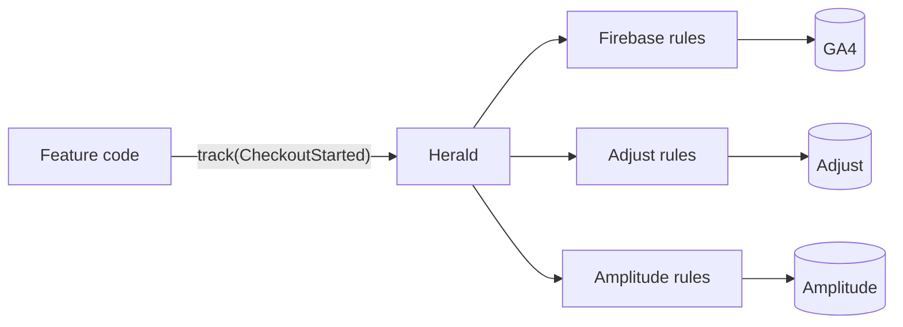

---
hide:
  - navigation
  - toc
---

<h1 class="herald-banner">
  
  
</h1>

*A herald announces an event to whoever is listening.*

Herald is an analytics library for mobile apps. Your app describes what happened as an event, and
Herald sends that event to every analytics service you use: Firebase, Adjust, Mixpanel, AppsFlyer,
Amplitude, or one you build yourself.

## Choose your SDK

-   :material-android:{ .lg .middle } **Android**

    ---

    Kotlin libraries on Maven Central: the core, one module per vendor, helpers for Compose, and a
    fake for your tests.

    [:octicons-arrow-right-24: Android SDK](sdks/android/index.md)

-   :simple-flutter:{ .lg .middle } **Flutter**

    ---

    Dart packages on pub.dev, over each vendor's official Flutter plugin: the core, one package
    per vendor, optional widgets, a logger and a fake for your tests.

    [:octicons-arrow-right-24: Flutter SDK](sdks/flutter/index.md)

-   :simple-apple:{ .lg .middle } **iOS** (beta)

    ---

    Swift packages, over each vendor's official iOS SDK: the core, one package per vendor, a logger
    and a fake for your tests.

    [:octicons-arrow-right-24: iOS SDK](sdks/ios/index.md)

## Why Herald

**Your features don't know which vendors you use.** A feature tracks its own event, like
`CheckoutStarted`, and never calls Firebase or Adjust directly. You can add, replace or remove a
vendor without touching feature code.

**Each vendor gets data the way it expects.** Vendors disagree on the details. GA4 wants screen
views as its own `screen_view` event. Adjust only takes events you created a token for. AppsFlyer
counts money only when it arrives as `af_revenue`. You describe these rules once per vendor,
instead of spreading them across the app.

**It fits apps split into feature modules.** Each feature module keeps its own events and decides
how they reach each vendor. The app module only chooses the vendors. It never needs a list of
every event in the app, so a new feature doesn't mean editing a shared file.

**One broken vendor can't break the rest.** If a vendor SDK throws, Herald catches the error,
tells you about it, and keeps sending to the other vendors. Your app keeps running.

**Easy to test.** Your classes depend on a small interface, not on a vendor SDK. In tests, a fake
records every event, so you can check exactly what was tracked.

## How it works

Your code calls `track(CheckoutStarted)`, and Herald hands the event to every vendor you set up.
For each vendor, you decide what happens to it: send it as it is, send it in that vendor's own
format, or don't send it at all.

You write those decisions in small classes called factories, usually in the feature that owns the
event. For example, your checkout feature can tell Adjust to send `CheckoutStarted` with the token
from your Adjust dashboard. It says nothing to Firebase, so Firebase sends the event as it is.

You don't write a factory for every event. Herald comes with ready-made factories for the common
cases: sending any event under its own name, sending screen views the way each vendor expects, and
saving user properties. You only write your own for events that need something special.

## Start here

- [Quick start](getting-started/quick-start.md): send your first event.
- [Philosophy](philosophy.md): why Herald works the way it does.
- [Guides](guides/routing.md): routing, feature modules, consent, identity, revenue and testing.
- [Vendors](vendors/firebase.md): what each vendor receives, and what to watch out for.
- [Moove](https://github.com/MkhytarMkhoian/Moove): a sample app that uses every module, including
  feature modules, consent, sign-in, Compose and a screen that shows every event it sent.
- [The Flutter example app](https://github.com/MkhytarMkhoian/herald-flutter/tree/main/example):
  screen views with and without `herald_widgets`, and a timeline of every event it sent.
